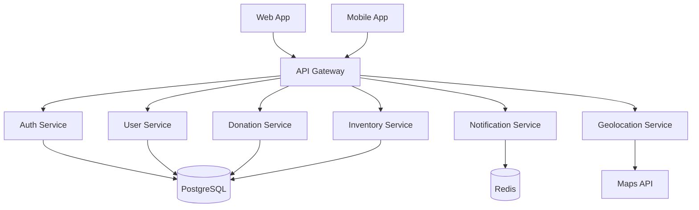
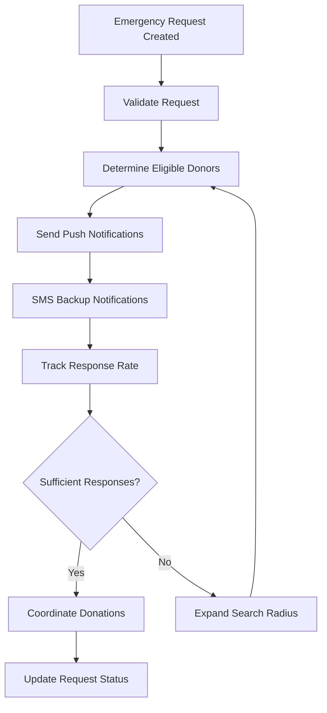

# Online Blood Donation Management System - Comprehensive Development Roadmap

## 🎯 Project Overview

**Project Name:** Online Blood Donation Management System (BDMS)  
**Duration:** 12 months  
**Team Size:** 8-10 developers  
**Budget:** $150,000 - $200,000  
**Target Users:** 100,000+ donors, 500+ hospitals, 50+ blood banks

## 🛠️ Recommended Technology Stack (Free & Open Source)

### **Backend Technologies**
- **Runtime:** Node.js 20+ LTS
- **Framework:** Express.js 4.18+
- **Database:** PostgreSQL 15+ (Primary), Redis 7+ (Caching)
- **ORM:** Prisma 5+ or Sequelize 6+
- **Authentication:** JWT + Passport.js
- **Real-time:** Socket.io 4+
- **File Storage:** MinIO (S3-compatible)
- **Search:** Elasticsearch 8+ (Free tier)

### **Frontend Technologies**
- **Framework:** React 18+ with TypeScript
- **UI Library:** Material-UI (MUI) 5+ or Tailwind CSS + shadcn/ui
- **State Management:** Redux Toolkit + RTK Query
- **Maps:** OpenStreetMap + Leaflet.js
- **Charts:** Chart.js or Recharts
- **PWA:** Workbox for offline support

### **Mobile Development**
- **Framework:** React Native 0.72+ or Flutter 3.10+
- **Navigation:** React Navigation 6+
- **Push Notifications:** Firebase Cloud Messaging (Free tier)

### **DevOps & Infrastructure**
- **Containerization:** Docker + Docker Compose
- **CI/CD:** GitHub Actions (Free for public repos)
- **Cloud Platform:** 
  - **Free Tier:** Railway, Render, or Vercel
  - **Production:** DigitalOcean, Linode, or AWS Free Tier
- **Monitoring:** Grafana + Prometheus (Open source)
- **Logging:** ELK Stack (Elasticsearch, Logstash, Kibana)

### **Testing & Quality**
- **Unit Testing:** Jest + React Testing Library
- **E2E Testing:** Playwright or Cypress
- **API Testing:** Supertest + Postman
- **Code Quality:** ESLint + Prettier + Husky

## 📋 Phase-by-Phase Development Plan

---

## **PHASE 1: PROJECT INITIATION & PLANNING (Weeks 1-4)**

### **Week 1-2: Requirements Analysis**

#### **Stakeholder Analysis**
- **Primary Users:**
  - Blood Donors (Individual, Corporate)
  - Recipients (Patients, Families)
  - Healthcare Providers (Hospitals, Clinics)
  - Blood Banks & Collection Centers
  - System Administrators

#### **Functional Requirements**
- User registration and profile management
- Blood donation scheduling and tracking
- Inventory management for blood banks
- Emergency blood request system
- Geolocation-based donor matching
- Real-time notifications
- Reporting and analytics
- Mobile application support

#### **Non-Functional Requirements**
- **Performance:** <2s page load time, 99.9% uptime
- **Security:** HIPAA compliance, data encryption
- **Scalability:** Support 10,000 concurrent users
- **Availability:** 24/7 system availability
- **Usability:** Intuitive interface for all user types

### **Week 3-4: System Architecture Design**

#### **Architecture Pattern**
- **Microservices Architecture** with API Gateway
- **Event-Driven Architecture** for real-time updates
- **CQRS Pattern** for read/write operations separation

#### **System Components**


#### **Deliverables**
- System Architecture Document
- Database Schema Design
- API Specification (OpenAPI 3.0)
- Security Architecture Plan
- Technology Stack Justification

---

## **PHASE 2: DATABASE DESIGN & SETUP (Weeks 5-6)**

### **Database Schema Design**

#### **Core Entities**

```sql
-- Users Table
CREATE TABLE users (
    id UUID PRIMARY KEY DEFAULT gen_random_uuid(),
    email VARCHAR(255) UNIQUE NOT NULL,
    password_hash VARCHAR(255),
    first_name VARCHAR(100) NOT NULL,
    last_name VARCHAR(100) NOT NULL,
    phone VARCHAR(20),
    date_of_birth DATE,
    gender VARCHAR(10),
    blood_type VARCHAR(5) NOT NULL,
    role VARCHAR(20) DEFAULT 'donor',
    is_verified BOOLEAN DEFAULT false,
    is_active BOOLEAN DEFAULT true,
    created_at TIMESTAMP DEFAULT NOW(),
    updated_at TIMESTAMP DEFAULT NOW()
);

-- Addresses Table
CREATE TABLE addresses (
    id UUID PRIMARY KEY DEFAULT gen_random_uuid(),
    user_id UUID REFERENCES users(id),
    street_address VARCHAR(255),
    city VARCHAR(100),
    state VARCHAR(100),
    postal_code VARCHAR(20),
    country VARCHAR(100),
    latitude DECIMAL(10, 8),
    longitude DECIMAL(11, 8),
    is_primary BOOLEAN DEFAULT false
);

-- Blood Banks Table
CREATE TABLE blood_banks (
    id UUID PRIMARY KEY DEFAULT gen_random_uuid(),
    name VARCHAR(255) NOT NULL,
    license_number VARCHAR(100) UNIQUE,
    address_id UUID REFERENCES addresses(id),
    contact_email VARCHAR(255),
    contact_phone VARCHAR(20),
    operating_hours JSONB,
    capacity INTEGER,
    is_active BOOLEAN DEFAULT true,
    created_at TIMESTAMP DEFAULT NOW()
);

-- Blood Inventory Table
CREATE TABLE blood_inventory (
    id UUID PRIMARY KEY DEFAULT gen_random_uuid(),
    blood_bank_id UUID REFERENCES blood_banks(id),
    blood_type VARCHAR(5) NOT NULL,
    units_available INTEGER DEFAULT 0,
    units_reserved INTEGER DEFAULT 0,
    expiry_date DATE,
    last_updated TIMESTAMP DEFAULT NOW()
);

-- Donations Table
CREATE TABLE donations (
    id UUID PRIMARY KEY DEFAULT gen_random_uuid(),
    donor_id UUID REFERENCES users(id),
    blood_bank_id UUID REFERENCES blood_banks(id),
    donation_date TIMESTAMP,
    blood_type VARCHAR(5),
    units_donated DECIMAL(3,1),
    status VARCHAR(20) DEFAULT 'scheduled',
    notes TEXT,
    created_at TIMESTAMP DEFAULT NOW()
);

-- Blood Requests Table
CREATE TABLE blood_requests (
    id UUID PRIMARY KEY DEFAULT gen_random_uuid(),
    requester_id UUID REFERENCES users(id),
    patient_name VARCHAR(255),
    blood_type VARCHAR(5) NOT NULL,
    units_needed INTEGER,
    urgency_level VARCHAR(20) DEFAULT 'normal',
    hospital_name VARCHAR(255),
    contact_phone VARCHAR(20),
    required_by TIMESTAMP,
    status VARCHAR(20) DEFAULT 'active',
    created_at TIMESTAMP DEFAULT NOW()
);

-- Notifications Table
CREATE TABLE notifications (
    id UUID PRIMARY KEY DEFAULT gen_random_uuid(),
    user_id UUID REFERENCES users(id),
    title VARCHAR(255),
    message TEXT,
    type VARCHAR(50),
    is_read BOOLEAN DEFAULT false,
    created_at TIMESTAMP DEFAULT NOW()
);
```

#### **Indexes for Performance**
```sql
CREATE INDEX idx_users_blood_type ON users(blood_type);
CREATE INDEX idx_users_location ON addresses(latitude, longitude);
CREATE INDEX idx_donations_date ON donations(donation_date);
CREATE INDEX idx_requests_urgency ON blood_requests(urgency_level, created_at);
CREATE INDEX idx_inventory_blood_type ON blood_inventory(blood_type, blood_bank_id);
```

---

## **PHASE 3: BACKEND API DEVELOPMENT (Weeks 7-12)**

### **API Architecture**

#### **Authentication & Authorization**
```javascript
// JWT Token Structure
{
  "sub": "user_id",
  "email": "user@example.com",
  "role": "donor|recipient|admin|blood_bank",
  "permissions": ["read:profile", "write:donation"],
  "exp": 1640995200
}

// Role-Based Access Control
const permissions = {
  donor: ['read:profile', 'write:donation', 'read:requests'],
  recipient: ['read:profile', 'write:request', 'read:donations'],
  blood_bank: ['read:inventory', 'write:inventory', 'read:donations'],
  admin: ['*']
};
```

#### **Core API Endpoints**

```javascript
// Authentication Routes
POST /api/auth/register
POST /api/auth/login
POST /api/auth/refresh
POST /api/auth/logout
POST /api/auth/verify-email
POST /api/auth/forgot-password

// User Management
GET /api/users/profile
PUT /api/users/profile
GET /api/users/donation-history
GET /api/users/eligibility

// Donation Management
POST /api/donations/schedule
GET /api/donations
PUT /api/donations/:id
DELETE /api/donations/:id
GET /api/donations/available-slots

// Blood Requests
POST /api/requests
GET /api/requests
PUT /api/requests/:id/status
GET /api/requests/urgent

// Inventory Management
GET /api/inventory/blood-banks
GET /api/inventory/:bloodType/availability
PUT /api/inventory/:id/update
GET /api/inventory/low-stock-alerts

// Geolocation Services
GET /api/locations/nearby-blood-banks
GET /api/locations/nearby-donors
POST /api/locations/calculate-distance

// Notifications
GET /api/notifications
PUT /api/notifications/:id/read
POST /api/notifications/send-bulk
```

### **Real-time Features with Socket.io**

```javascript
// Emergency Request Broadcasting
io.to('donors').emit('emergency_request', {
  requestId: 'req_123',
  bloodType: 'O-',
  location: { lat: 40.7128, lng: -74.0060 },
  urgency: 'critical'
});

// Inventory Updates
io.to('blood_banks').emit('inventory_update', {
  bloodBankId: 'bb_456',
  bloodType: 'A+',
  unitsAvailable: 15
});
```

---

## **PHASE 4: FRONTEND DEVELOPMENT (Weeks 13-18)**

### **User Interface Design**

#### **Design System**
- **Color Palette:** Medical-themed (Red, White, Blue)
- **Typography:** Inter or Roboto for accessibility
- **Components:** Reusable component library
- **Responsive Design:** Mobile-first approach

#### **Key User Interfaces**

**1. Donor Dashboard**
```jsx
const DonorDashboard = () => {
  return (
    <Grid container spacing={3}>
      <Grid item xs={12} md={4}>
        <StatsCard 
          title="Total Donations" 
          value={12} 
          icon={<BloodtypeIcon />} 
        />
      </Grid>
      <Grid item xs={12} md={8}>
        <DonationHistory />
      </Grid>
      <Grid item xs={12}>
        <NearbyRequests />
      </Grid>
    </Grid>
  );
};
```

**2. Emergency Request Interface**
```jsx
const EmergencyRequest = () => {
  return (
    <Card sx={{ backgroundColor: '#ffebee' }}>
      <CardHeader 
        title="URGENT: Blood Needed"
        avatar={<EmergencyIcon color="error" />}
      />
      <CardContent>
        <Typography variant="h6">Type: O- Negative</Typography>
        <Typography>Units: 4</Typography>
        <Typography>Location: City Hospital</Typography>
        <Button variant="contained" color="error">
          I Can Donate
        </Button>
      </CardContent>
    </Card>
  );
};
```

**3. Blood Bank Inventory**
```jsx
const InventoryManagement = () => {
  return (
    <TableContainer>
      <Table>
        <TableHead>
          <TableRow>
            <TableCell>Blood Type</TableCell>
            <TableCell>Available Units</TableCell>
            <TableCell>Expiry Date</TableCell>
            <TableCell>Status</TableCell>
          </TableRow>
        </TableHead>
        <TableBody>
          {inventory.map((item) => (
            <TableRow key={item.id}>
              <TableCell>{item.bloodType}</TableCell>
              <TableCell>
                <Chip 
                  label={item.units}
                  color={item.units < 10 ? 'error' : 'success'}
                />
              </TableCell>
              <TableCell>{item.expiryDate}</TableCell>
              <TableCell>
                <StatusIndicator status={item.status} />
              </TableCell>
            </TableRow>
          ))}
        </TableBody>
      </Table>
    </TableContainer>
  );
};
```

### **Progressive Web App Features**
- Offline functionality for critical features
- Push notifications for emergency requests
- Background sync for data updates
- App-like experience on mobile devices

---

## **PHASE 5: MOBILE APPLICATION DEVELOPMENT (Weeks 19-22)**

### **React Native Implementation**

#### **Core Features**
- Cross-platform compatibility (iOS/Android)
- Push notifications for urgent requests
- GPS-based location services
- Offline data synchronization
- Biometric authentication

#### **Key Screens**
```jsx
// Emergency Alert Screen
const EmergencyAlert = () => {
  return (
    <View style={styles.container}>
      <Text style={styles.urgentText}>URGENT BLOOD NEEDED</Text>
      <BloodTypeDisplay type="O-" />
      <LocationMap coordinates={emergencyLocation} />
      <TouchableOpacity style={styles.donateButton}>
        <Text>I Can Help</Text>
      </TouchableOpacity>
    </View>
  );
};

// Donation Scheduler
const DonationScheduler = () => {
  return (
    <ScrollView>
      <CalendarPicker onDateChange={setSelectedDate} />
      <TimeSlotPicker availableSlots={slots} />
      <BloodBankSelector nearbyBanks={bloodBanks} />
      <Button title="Schedule Donation" onPress={scheduleDonation} />
    </ScrollView>
  );
};
```

---

## **PHASE 6: INTEGRATION & TESTING (Weeks 23-26)**

### **Integration Requirements**

#### **Third-Party Integrations**
- **Maps & Geolocation:** OpenStreetMap + Nominatim
- **SMS Gateway:** Twilio (Free tier: 1000 messages)
- **Email Service:** SendGrid (Free tier: 100 emails/day)
- **Push Notifications:** Firebase Cloud Messaging
- **Payment Gateway:** Stripe (for donations/fees)

#### **Medical Database Integration**
- **Blood Bank Registry:** Integration with national blood bank database
- **Hospital Systems:** HL7 FHIR standard for interoperability
- **Lab Results:** Integration with pathology labs for blood testing

### **Testing Strategy**

#### **Unit Testing (80% Coverage)**
```javascript
// Example: Donation Service Test
describe('DonationService', () => {
  test('should schedule donation successfully', async () => {
    const donationData = {
      donorId: 'donor_123',
      bloodBankId: 'bb_456',
      date: '2024-01-15T10:00:00Z'
    };
    
    const result = await donationService.schedule(donationData);
    expect(result.status).toBe('scheduled');
    expect(result.id).toBeDefined();
  });
});
```

#### **Integration Testing**
- API endpoint testing with Supertest
- Database integration testing
- Third-party service integration testing

#### **End-to-End Testing**
```javascript
// Playwright E2E Test
test('donor can schedule donation', async ({ page }) => {
  await page.goto('/dashboard');
  await page.click('[data-testid="schedule-donation"]');
  await page.selectOption('[data-testid="blood-bank"]', 'bb_456');
  await page.click('[data-testid="confirm-schedule"]');
  await expect(page.locator('.success-message')).toBeVisible();
});
```

---

## **PHASE 7: SECURITY & COMPLIANCE (Weeks 27-28)**

### **Security Implementation**

#### **Data Protection**
```javascript
// Encryption at Rest
const encryptSensitiveData = (data) => {
  return crypto.encrypt(data, process.env.ENCRYPTION_KEY);
};

// HIPAA Compliance Logging
const auditLogger = {
  logAccess: (userId, resource, action) => {
    console.log({
      timestamp: new Date().toISOString(),
      userId,
      resource,
      action,
      ip: req.ip,
      userAgent: req.get('User-Agent')
    });
  }
};
```

#### **Security Measures**
- **Authentication:** Multi-factor authentication (MFA)
- **Authorization:** Role-based access control (RBAC)
- **Data Encryption:** AES-256 encryption for sensitive data
- **API Security:** Rate limiting, input validation, CORS
- **Audit Logging:** Comprehensive audit trails
- **Vulnerability Scanning:** Regular security assessments

### **Compliance Requirements**
- **HIPAA:** Health Insurance Portability and Accountability Act
- **GDPR:** General Data Protection Regulation
- **FDA:** Food and Drug Administration guidelines
- **Local Regulations:** Country-specific healthcare regulations

---

## **PHASE 8: DEPLOYMENT & DEVOPS (Weeks 29-30)**

### **CI/CD Pipeline**

#### **GitHub Actions Workflow**
```yaml
name: BDMS CI/CD Pipeline

on:
  push:
    branches: [main, develop]
  pull_request:
    branches: [main]

jobs:
  test:
    runs-on: ubuntu-latest
    steps:
      - uses: actions/checkout@v3
      - uses: actions/setup-node@v3
        with:
          node-version: '18'
      - run: npm ci
      - run: npm run test
      - run: npm run test:e2e

  build:
    needs: test
    runs-on: ubuntu-latest
    steps:
      - uses: actions/checkout@v3
      - run: docker build -t bdms-app .
      - run: docker push ${{ secrets.DOCKER_REGISTRY }}/bdms-app

  deploy:
    needs: build
    runs-on: ubuntu-latest
    if: github.ref == 'refs/heads/main'
    steps:
      - run: kubectl apply -f k8s/
```

### **Infrastructure as Code**
```yaml
# docker-compose.yml
version: '3.8'
services:
  app:
    build: .
    ports:
      - "3000:3000"
    environment:
      - DATABASE_URL=${DATABASE_URL}
      - REDIS_URL=${REDIS_URL}
    depends_on:
      - postgres
      - redis

  postgres:
    image: postgres:15
    environment:
      POSTGRES_DB: bdms
      POSTGRES_USER: ${DB_USER}
      POSTGRES_PASSWORD: ${DB_PASSWORD}
    volumes:
      - postgres_data:/var/lib/postgresql/data

  redis:
    image: redis:7-alpine
    volumes:
      - redis_data:/data
```

### **Monitoring & Logging**
```javascript
// Prometheus Metrics
const promClient = require('prom-client');

const httpRequestDuration = new promClient.Histogram({
  name: 'http_request_duration_seconds',
  help: 'Duration of HTTP requests in seconds',
  labelNames: ['method', 'route', 'status']
});

// Health Check Endpoint
app.get('/health', (req, res) => {
  res.json({
    status: 'healthy',
    timestamp: new Date().toISOString(),
    uptime: process.uptime(),
    version: process.env.APP_VERSION
  });
});
```

---

## **PHASE 9: USER ACCEPTANCE TESTING (Weeks 31-32)**

### **UAT Strategy**

#### **Test User Groups**
- **Donors:** 50 volunteer blood donors
- **Recipients:** 20 patients/families
- **Blood Banks:** 10 blood bank staff members
- **Hospitals:** 15 healthcare professionals

#### **Testing Scenarios**
1. **Donor Registration & Profile Setup**
2. **Donation Scheduling & Confirmation**
3. **Emergency Request Response**
4. **Blood Bank Inventory Management**
5. **Mobile App Functionality**
6. **Notification System Testing**

#### **Success Criteria**
- 95% task completion rate
- <3 critical bugs per 100 test cases
- Average user satisfaction score >4.5/5
- System performance meets requirements

---

## **PHASE 10: TRAINING & DOCUMENTATION (Weeks 33-34)**

### **Documentation Deliverables**

#### **Technical Documentation**
- **API Documentation:** OpenAPI/Swagger specifications
- **Database Schema:** Entity relationship diagrams
- **Deployment Guide:** Step-by-step deployment instructions
- **Security Manual:** Security protocols and procedures

#### **User Documentation**
- **User Manuals:** Role-specific user guides
- **Video Tutorials:** Screen-recorded walkthroughs
- **FAQ Section:** Common questions and answers
- **Troubleshooting Guide:** Problem resolution steps

### **Training Programs**

#### **Administrator Training (2 days)**
- System overview and architecture
- User management and permissions
- Monitoring and maintenance procedures
- Security protocols and compliance

#### **End-User Training (1 day)**
- Platform navigation and features
- Donation scheduling and management
- Emergency request handling
- Mobile app usage

---

## **PHASE 11: PRODUCTION DEPLOYMENT (Weeks 35-36)**

### **Deployment Strategy**

#### **Blue-Green Deployment**
```bash
# Deploy to staging environment
kubectl apply -f k8s/staging/

# Run smoke tests
npm run test:smoke

# Switch traffic to new version
kubectl patch service bdms-service -p '{"spec":{"selector":{"version":"v2"}}}'

# Monitor for issues
kubectl logs -f deployment/bdms-app
```

#### **Database Migration**
```sql
-- Migration script v1.0.0
BEGIN;

-- Add new columns
ALTER TABLE users ADD COLUMN last_donation_date TIMESTAMP;
ALTER TABLE blood_inventory ADD COLUMN temperature_log JSONB;

-- Update existing data
UPDATE users SET last_donation_date = (
  SELECT MAX(donation_date) FROM donations WHERE donor_id = users.id
);

COMMIT;
```

### **Go-Live Checklist**
- [ ] Production environment configured
- [ ] SSL certificates installed
- [ ] Database backups scheduled
- [ ] Monitoring alerts configured
- [ ] Load balancer configured
- [ ] CDN setup for static assets
- [ ] DNS records updated
- [ ] Security scanning completed

---

## **PHASE 12: POST-LAUNCH SUPPORT & MAINTENANCE (Weeks 37-52)**

### **Maintenance Activities**

#### **Regular Maintenance Tasks**
- **Daily:** System health monitoring, backup verification
- **Weekly:** Performance analysis, security updates
- **Monthly:** Database optimization, user feedback review
- **Quarterly:** Security audits, compliance reviews

#### **Support Structure**
- **Level 1:** Basic user support (response time: 4 hours)
- **Level 2:** Technical issues (response time: 2 hours)
- **Level 3:** Critical system issues (response time: 30 minutes)

### **Performance Monitoring**
```javascript
// Key Performance Indicators
const kpis = {
  systemUptime: '99.9%',
  averageResponseTime: '<2 seconds',
  dailyActiveUsers: 'target: 1000+',
  donationConversionRate: 'target: 15%',
  emergencyResponseTime: 'target: <5 minutes'
};
```

---

## 📊 **PROJECT TIMELINE & MILESTONES**

### **Major Milestones**

| Phase | Duration | Key Deliverables | Success Criteria |
|-------|----------|------------------|------------------|
| **Phase 1** | Weeks 1-4 | Requirements, Architecture | Stakeholder approval |
| **Phase 2** | Weeks 5-6 | Database Design | Schema validation |
| **Phase 3** | Weeks 7-12 | Backend APIs | API testing complete |
| **Phase 4** | Weeks 13-18 | Frontend App | UI/UX approval |
| **Phase 5** | Weeks 19-22 | Mobile App | App store ready |
| **Phase 6** | Weeks 23-26 | Integration & Testing | 95% test coverage |
| **Phase 7** | Weeks 27-28 | Security & Compliance | Security audit pass |
| **Phase 8** | Weeks 29-30 | Deployment Setup | Production ready |
| **Phase 9** | Weeks 31-32 | User Acceptance Testing | UAT approval |
| **Phase 10** | Weeks 33-34 | Training & Documentation | Training complete |
| **Phase 11** | Weeks 35-36 | Production Deployment | Go-live successful |
| **Phase 12** | Weeks 37-52 | Support & Maintenance | System stable |

### **Critical Path Activities**
1. Database schema finalization
2. Core API development
3. Real-time notification system
4. Mobile app development
5. Security implementation
6. User acceptance testing

---

## 👥 **RESOURCE ALLOCATION**

### **Team Structure**

#### **Core Development Team (8 members)**
- **Project Manager** (1) - Overall project coordination
- **Backend Developers** (2) - API development, database design
- **Frontend Developers** (2) - Web application development
- **Mobile Developer** (1) - React Native/Flutter development
- **DevOps Engineer** (1) - Infrastructure, deployment, monitoring
- **QA Engineer** (1) - Testing, quality assurance

#### **Extended Team (Part-time)**
- **UI/UX Designer** (0.5 FTE) - Design system, user experience
- **Security Consultant** (0.25 FTE) - Security review, compliance
- **Medical Domain Expert** (0.25 FTE) - Requirements validation

### **Budget Breakdown**

| Category | Cost | Percentage |
|----------|------|------------|
| **Development Team** | $120,000 | 60% |
| **Infrastructure & Tools** | $20,000 | 10% |
| **Third-party Services** | $15,000 | 7.5% |
| **Testing & QA** | $20,000 | 10% |
| **Training & Documentation** | $10,000 | 5% |
| **Contingency** | $15,000 | 7.5% |
| **Total** | **$200,000** | **100%** |

---

## 🔒 **COMPLIANCE & REGULATORY CONSIDERATIONS**

### **Healthcare Regulations**
- **HIPAA Compliance:** Patient data protection
- **FDA Guidelines:** Blood collection and storage standards
- **State Regulations:** Local blood bank licensing requirements
- **International Standards:** ISO 27001 for information security

### **Data Privacy**
- **GDPR Compliance:** European data protection regulation
- **CCPA Compliance:** California Consumer Privacy Act
- **Data Retention:** Automated data purging policies
- **Consent Management:** Granular privacy controls

---

## 📱 **MOBILE APPLICATION FEATURES**

### **Core Mobile Features**
- **Donor Registration:** Quick signup with photo ID verification
- **Donation Scheduling:** Calendar integration with reminders
- **Emergency Alerts:** Push notifications for urgent requests
- **Location Services:** GPS-based blood bank finder
- **Health Tracking:** Donation history and health metrics
- **Offline Mode:** Core features available without internet

### **Advanced Mobile Features**
- **Biometric Authentication:** Fingerprint/Face ID login
- **QR Code Scanning:** Quick check-in at blood banks
- **Social Sharing:** Share donation achievements
- **Gamification:** Badges and leaderboards for donors
- **Telemedicine Integration:** Pre-donation health consultations

---

## 📈 **SCALABILITY PLANNING**

### **Performance Targets**
- **Concurrent Users:** 10,000 simultaneous users
- **Database Performance:** <100ms query response time
- **API Throughput:** 1000 requests/second
- **Mobile App:** <3 second startup time
- **Notification Delivery:** <30 seconds for emergency alerts

### **Scaling Strategies**
- **Horizontal Scaling:** Load balancer with multiple app instances
- **Database Scaling:** Read replicas and connection pooling
- **Caching Strategy:** Redis for session and frequently accessed data
- **CDN Implementation:** Static asset delivery optimization
- **Microservices:** Service decomposition for independent scaling

---

## 🚨 **EMERGENCY RESPONSE SYSTEM**

### **Emergency Request Workflow**


### **Emergency Features**
- **Automated Donor Matching:** AI-powered donor selection
- **Multi-channel Notifications:** Push, SMS, email, phone calls
- **Real-time Tracking:** Live donation status updates
- **Hospital Integration:** Direct communication with medical staff
- **Escalation Procedures:** Automatic escalation for critical cases

---

## 📊 **REPORTING & ANALYTICS**

### **Dashboard Metrics**
- **Donation Statistics:** Daily, weekly, monthly donation trends
- **Inventory Levels:** Real-time blood bank inventory status
- **User Engagement:** Active users, retention rates
- **Emergency Response:** Response times, success rates
- **Geographic Analysis:** Donation patterns by location

### **Advanced Analytics**
- **Predictive Analytics:** Blood demand forecasting
- **Donor Behavior Analysis:** Donation patterns and preferences
- **Supply Chain Optimization:** Inventory management insights
- **Performance Metrics:** System performance and user satisfaction

---

## 🔧 **MAINTENANCE & SUPPORT**

### **Maintenance Schedule**
- **Daily:** Automated backups, system health checks
- **Weekly:** Performance monitoring, security updates
- **Monthly:** Database optimization, user feedback review
- **Quarterly:** Security audits, compliance reviews
- **Annually:** Major system updates, technology refresh

### **Support Levels**
- **Self-Service:** FAQ, knowledge base, video tutorials
- **Community Support:** User forums, peer assistance
- **Professional Support:** 24/7 technical support for critical issues
- **Enterprise Support:** Dedicated support for large organizations

---

## 🎯 **SUCCESS METRICS & KPIs**

### **Business Metrics**
- **User Adoption:** 100,000+ registered users within 6 months
- **Donation Volume:** 20% increase in blood donations
- **Emergency Response:** <5 minute average response time
- **User Satisfaction:** >4.5/5 average rating
- **System Uptime:** 99.9% availability

### **Technical Metrics**
- **Performance:** <2 second page load times
- **Security:** Zero critical security incidents
- **Quality:** <1% critical bug rate
- **Scalability:** Support for 10,000 concurrent users
- **Mobile Adoption:** 70% of users using mobile app

---

## 🚀 **FUTURE ENHANCEMENTS**

### **Phase 2 Features (Year 2)**
- **AI-Powered Matching:** Machine learning for donor-recipient matching
- **Blockchain Integration:** Transparent blood supply chain tracking
- **IoT Integration:** Smart blood storage monitoring
- **Telemedicine:** Virtual health consultations
- **International Expansion:** Multi-country support

### **Phase 3 Features (Year 3)**
- **Genetic Matching:** Advanced compatibility testing
- **Drone Delivery:** Emergency blood transport
- **VR Training:** Virtual reality training for medical staff
- **Predictive Analytics:** AI-driven demand forecasting
- **Global Network:** International blood sharing network

---

## 📋 **RISK MANAGEMENT**

### **Technical Risks**
- **Data Security Breaches:** Comprehensive security measures and monitoring
- **System Downtime:** Redundant systems and disaster recovery plans
- **Integration Failures:** Thorough testing and fallback procedures
- **Performance Issues:** Load testing and optimization strategies

### **Business Risks**
- **Regulatory Changes:** Continuous compliance monitoring and updates
- **User Adoption:** Comprehensive marketing and user engagement strategies
- **Competition:** Unique features and superior user experience
- **Funding:** Diversified funding sources and cost optimization

### **Mitigation Strategies**
- **Regular Risk Assessments:** Monthly risk evaluation and mitigation planning
- **Contingency Planning:** Detailed backup plans for critical scenarios
- **Insurance Coverage:** Comprehensive liability and cyber insurance
- **Stakeholder Communication:** Regular updates and transparent reporting

---

## 📚 **DOCUMENTATION STANDARDS**

### **Technical Documentation**
- **Code Documentation:** Inline comments and API documentation
- **Architecture Documentation:** System design and component diagrams
- **Database Documentation:** Schema definitions and relationships
- **Deployment Documentation:** Step-by-step deployment procedures

### **User Documentation**
- **User Guides:** Comprehensive user manuals for each role
- **Training Materials:** Interactive tutorials and video guides
- **FAQ Documentation:** Common questions and troubleshooting
- **Help System:** Context-sensitive in-app help

### **Process Documentation**
- **Development Processes:** Coding standards and review procedures
- **Testing Procedures:** Test plans and quality assurance processes
- **Deployment Procedures:** Release management and rollback plans
- **Support Procedures:** Issue escalation and resolution processes

---

## 🔄 **VERSION CONTROL STRATEGIES**

### **Git Workflow**
- **Main Branch:** Production-ready code
- **Develop Branch:** Integration branch for features
- **Feature Branches:** Individual feature development
- **Release Branches:** Release preparation and bug fixes
- **Hotfix Branches:** Critical production fixes

### **Code Review Process**
- **Pull Request Reviews:** Mandatory peer reviews for all changes
- **Automated Testing:** CI/CD pipeline with automated tests
- **Code Quality Checks:** Linting and static analysis
- **Security Scanning:** Automated vulnerability detection

### **Release Management**
- **Semantic Versioning:** Clear version numbering system
- **Release Notes:** Detailed change documentation
- **Rollback Procedures:** Quick reversion capabilities
- **Feature Flags:** Controlled feature rollouts

---

## 🎓 **QUALITY ASSURANCE CHECKPOINTS**

### **Development Quality Gates**
- **Code Review Approval:** Mandatory peer review before merge
- **Unit Test Coverage:** Minimum 80% test coverage
- **Integration Testing:** All APIs and services tested
- **Security Scanning:** Automated vulnerability assessment

### **Release Quality Gates**
- **Performance Testing:** Load and stress testing completion
- **Security Audit:** Third-party security assessment
- **User Acceptance Testing:** Stakeholder approval
- **Documentation Review:** Complete and accurate documentation

### **Production Quality Gates**
- **Deployment Verification:** Smoke testing after deployment
- **Monitoring Setup:** All monitoring systems operational
- **Backup Verification:** Backup and recovery procedures tested
- **Support Readiness:** Support team trained and ready

---

## 📞 **STAKEHOLDER COMMUNICATION PLAN**

### **Communication Channels**
- **Weekly Status Reports:** Progress updates and milestone tracking
- **Monthly Stakeholder Meetings:** Detailed progress reviews
- **Quarterly Business Reviews:** Strategic alignment and planning
- **Ad-hoc Communications:** Issue escalation and urgent updates

### **Reporting Structure**
- **Executive Dashboard:** High-level metrics and KPIs
- **Project Status Reports:** Detailed progress and issue tracking
- **Technical Reports:** Architecture and implementation details
- **User Feedback Reports:** User satisfaction and improvement suggestions

### **Change Management**
- **Change Request Process:** Formal change evaluation and approval
- **Impact Assessment:** Technical and business impact analysis
- **Stakeholder Approval:** Required approvals for scope changes
- **Communication Plan:** Change notification and implementation

---

This comprehensive roadmap provides a complete blueprint for developing an enterprise-grade Online Blood Donation Management System using free and open-source technologies, ensuring cost-effectiveness while maintaining high quality and security standards.
