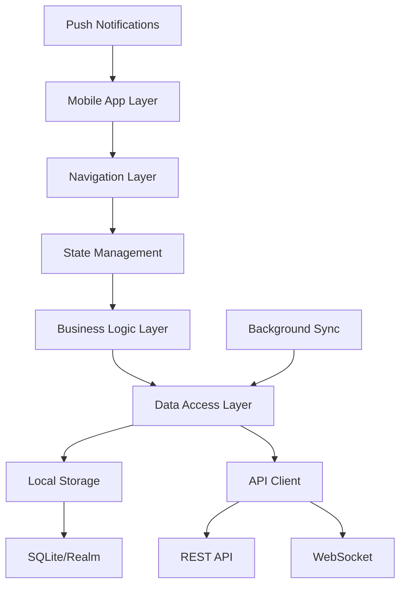

# Mobile Blood Donation Management App - Comprehensive Development Roadmap

## 🎯 Project Overview

**Project Name:** Mobile Blood Donation Management App (BDMA)  
**Duration:** 10 months  
**Team Size:** 6-8 developers  
**Budget:** $100,000 - $150,000  
**Target Users:** 150,000+ mobile users, 500+ hospitals, 50+ blood banks  
**Platforms:** iOS, Android, Cross-platform

## 🛠️ Recommended Mobile Technology Stack (Free & Open Source)

### **Mobile App Technologies**
- **Framework:** React Native 0.72+ or Flutter 3.16+
- **Language:** TypeScript/JavaScript (React Native) or Dart (Flutter)
- **State Management:** Redux Toolkit (RN) or Riverpod/Bloc (Flutter)
- **Navigation:** React Navigation 6+ (RN) or GoRouter (Flutter)
- **UI Components:** React Native Elements/NativeBase or Flutter Material/Cupertino
- **Maps Integration:** React Native Maps or Google Maps Flutter plugin
- **Charts:** Victory Native (RN) or FL Chart (Flutter)

### **Backend & API Technologies**
- **Runtime:** Node.js 20+ LTS
- **Framework:** Express.js 4.18+ or Fastify 4+
- **Database:** PostgreSQL 15+ (Primary), Redis 7+ (Caching)
- **Real-time:** Socket.io 4+ or WebSocket
- **Authentication:** JWT + OAuth2 (Google, Apple)
- **Push Notifications:** Firebase Cloud Messaging (FCM)
- **File Storage:** AWS S3 Compatible (MinIO)

### **Mobile-Specific Services**
- **Push Notifications:** Firebase Cloud Messaging (Free tier)
- **Analytics:** Firebase Analytics or Mixpanel (Free tier)
- **Crash Reporting:** Firebase Crashlytics or Bugsnag
- **App Distribution:** Firebase App Distribution for testing
- **Maps & Location:** Google Maps API or Apple MapKit
- **Payment Integration:** Stripe Mobile SDK or PayPal Mobile
- **Biometrics:** React Native Touch ID/Face ID or local_auth (Flutter)

### **Development & Testing Tools**
- **Code Editor:** VS Code with React Native/Flutter extensions
- **Emulators:** Android Studio AVD, Xcode Simulator
- **Testing:** Jest + Detox (RN) or Flutter Test + Integration Test
- **CI/CD:** GitHub Actions with Fastlane
- **Code Quality:** ESLint/Prettier (RN) or Dart Analysis (Flutter)
- **App Store Deployment:** Fastlane for automated deployment

### **DevOps & Infrastructure**
- **Version Control:** Git with GitFlow
- **CI/CD:** GitHub Actions + Fastlane + CodeMagic
- **Backend Hosting:** Railway, Render, or DigitalOcean
- **Database Hosting:** Supabase, PlanetScale, or MongoDB Atlas
- **Monitoring:** Sentry, Firebase Performance Monitoring

## 📋 Phase-by-Phase Mobile Development Plan

---

## **PHASE 1: PROJECT SETUP & PLANNING (Weeks 1-3)**

### **Week 1: Mobile Requirements Analysis**

#### **Mobile-Specific User Requirements**
- **Primary Mobile Users:**
  - Blood Donors (on-the-go registration and scheduling)
  - Emergency Responders (quick blood request access)
  - Blood Bank Staff (mobile inventory management)
  - Hospital Staff (urgent request creation)

#### **Core Mobile Features**
- Offline-first architecture for critical features
- Push notifications for emergency alerts
- GPS-based location services
- Biometric authentication (Touch ID/Face ID)
- Camera integration for document scanning
- Barcode/QR code scanning for verification
- Voice commands for accessibility
- Dark mode support

#### **Mobile Platform Considerations**
- **iOS Requirements:** iOS 14.0+ support
- **Android Requirements:** API level 21+ (Android 5.0+)
- **Cross-platform Compatibility:** 95% feature parity
- **Device Support:** Phones and tablets
- **Performance:** <3 second app startup time

### **Week 2-3: Mobile Architecture Design**

#### **Mobile App Architecture Pattern**


#### **Mobile App Structure**
```
src/
├── components/          # Reusable UI components
│   ├── common/         # Generic components
│   ├── forms/          # Form components
│   └── screens/        # Screen-specific components
├── screens/            # Main app screens
│   ├── auth/           # Authentication screens
│   ├── dashboard/      # User dashboard
│   ├── donation/       # Donation management
│   ├── emergency/      # Emergency requests
│   └── profile/        # User profile
├── navigation/         # Navigation configuration
├── services/           # API and business logic
├── store/             # State management
├── utils/             # Helper functions
├── assets/            # Images, fonts, etc.
└── types/             # TypeScript definitions
```

---

## **PHASE 2: MOBILE DEVELOPMENT ENVIRONMENT SETUP (Weeks 4-5)**

### **Development Environment Configuration**

#### **React Native Setup**
```bash
# Install React Native CLI
npm install -g @react-native-community/cli

# Create new project
npx react-native init BloodDonationApp --template react-native-template-typescript

# Install essential dependencies
npm install @react-navigation/native @react-navigation/stack
npm install react-native-gesture-handler react-native-screens
npm install @reduxjs/toolkit react-redux
npm install react-native-vector-icons
npm install react-native-maps
npm install @react-native-firebase/app @react-native-firebase/messaging
```

#### **Flutter Setup** (Alternative)
```bash
# Install Flutter SDK
git clone https://github.com/flutter/flutter.git
export PATH="$PATH:`pwd`/flutter/bin"

# Create new project
flutter create blood_donation_app

# Add dependencies in pubspec.yaml
dependencies:
  flutter:
    sdk: flutter
  firebase_core: ^2.15.0
  firebase_messaging: ^14.6.5
  google_maps_flutter: ^2.4.0
  riverpod: ^2.3.6
  go_router: ^10.1.2
```

### **Mobile-Specific Configuration**

#### **iOS Configuration**
```xml
<!-- ios/BloodDonationApp/Info.plist -->
<key>NSLocationWhenInUseUsageDescription</key>
<string>This app needs location access to find nearby blood banks</string>
<key>NSCameraUsageDescription</key>
<string>This app needs camera access to scan documents</string>
<key>NSFaceIDUsageDescription</key>
<string>Use Face ID to securely access your account</string>
```

#### **Android Configuration**
```xml
<!-- android/app/src/main/AndroidManifest.xml -->
<uses-permission android:name="android.permission.ACCESS_FINE_LOCATION" />
<uses-permission android:name="android.permission.CAMERA" />
<uses-permission android:name="android.permission.USE_FINGERPRINT" />
<uses-permission android:name="android.permission.RECEIVE_BOOT_COMPLETED" />
```

---

## **PHASE 3: CORE MOBILE FEATURES DEVELOPMENT (Weeks 6-12)**

### **Authentication & Onboarding**

#### **Mobile Authentication Flow**
```typescript
// React Native Authentication Service
class AuthService {
  async signInWithBiometrics(): Promise<AuthResult> {
    const biometryType = await TouchID.isSupported();
    if (biometryType) {
      const result = await TouchID.authenticate('Authenticate to access your account');
      return this.validateBiometricAuth(result);
    }
    throw new Error('Biometrics not supported');
  }

  async signInWithGoogle(): Promise<AuthResult> {
    await GoogleSignin.hasPlayServices();
    const userInfo = await GoogleSignin.signIn();
    return this.exchangeGoogleToken(userInfo.idToken);
  }

  async signInWithApple(): Promise<AuthResult> {
    const appleAuthRequestResponse = await appleAuth.performRequest({
      requestedOperation: appleAuth.Operation.LOGIN,
      requestedScopes: [appleAuth.Scope.EMAIL, appleAuth.Scope.FULL_NAME],
    });
    return this.exchangeAppleToken(appleAuthRequestResponse.identityToken);
  }
}
```

#### **Onboarding Screens**
```typescript
// Onboarding Flow Component
const OnboardingFlow: React.FC = () => {
  const slides = [
    {
      title: "Save Lives",
      description: "Your blood donation can save up to 3 lives",
      image: require('../assets/onboarding/save-lives.png')
    },
    {
      title: "Find Blood Banks",
      description: "Locate nearby blood banks with GPS",
      image: require('../assets/onboarding/find-banks.png')
    },
    {
      title: "Emergency Alerts",
      description: "Get notified about urgent blood needs",
      image: require('../assets/onboarding/emergency.png')
    }
  ];

  return (
    <AppIntroSlider
      data={slides}
      renderItem={renderSlide}
      onDone={handleOnboardingComplete}
      showSkipButton={true}
    />
  );
};
```

### **Dashboard & Navigation**

#### **Main Dashboard Screen**
```typescript
const DashboardScreen: React.FC = () => {
  const { user } = useAuth();
  const { donations, emergencyRequests } = useSelector(state => state.dashboard);

  return (
    <ScrollView style={styles.container}>
      <Header user={user} />
      
      <QuickActions>
        <ActionCard 
          title="Schedule Donation"
          icon="calendar"
          onPress={() => navigation.navigate('ScheduleDonation')}
        />
        <ActionCard 
          title="Emergency Requests"
          icon="alert"
          badge={emergencyRequests.length}
          onPress={() => navigation.navigate('EmergencyRequests')}
        />
        <ActionCard 
          title="Find Blood Banks"
          icon="map"
          onPress={() => navigation.navigate('BloodBankMap')}
        />
      </QuickActions>

      <StatsSection>
        <StatCard title="Total Donations" value={user.totalDonations} />
        <StatCard title="Lives Saved" value={user.totalDonations * 3} />
        <StatCard title="Next Eligible" value={user.nextEligibleDate} />
      </StatsSection>

      <RecentActivity donations={donations} />
    </ScrollView>
  );
};
```

#### **Bottom Tab Navigation**
```typescript
const TabNavigator: React.FC = () => {
  return (
    <Tab.Navigator
      screenOptions={({ route }) => ({
        tabBarIcon: ({ focused, color, size }) => {
          const iconName = getTabIcon(route.name, focused);
          return <Icon name={iconName} size={size} color={color} />;
        },
        tabBarActiveTintColor: '#e74c3c',
        tabBarInactiveTintColor: 'gray',
      })}
    >
      <Tab.Screen name="Dashboard" component={DashboardScreen} />
      <Tab.Screen name="Donations" component={DonationsScreen} />
      <Tab.Screen name="Requests" component={RequestsScreen} />
      <Tab.Screen name="Map" component={MapScreen} />
      <Tab.Screen name="Profile" component={ProfileScreen} />
    </Tab.Navigator>
  );
};
```

### **Location & Maps Integration**

#### **Blood Bank Map with GPS**
```typescript
const BloodBankMapScreen: React.FC = () => {
  const [location, setLocation] = useState<Location | null>(null);
  const [bloodBanks, setBloodBanks] = useState<BloodBank[]>([]);

  useEffect(() => {
    getCurrentLocation();
    fetchNearbyBloodBanks();
  }, []);

  const getCurrentLocation = async () => {
    const hasPermission = await requestLocationPermission();
    if (hasPermission) {
      Geolocation.getCurrentPosition(
        position => setLocation(position.coords),
        error => console.error(error),
        { enableHighAccuracy: true, timeout: 15000, maximumAge: 10000 }
      );
    }
  };

  return (
    <View style={styles.container}>
      <MapView
        style={styles.map}
        region={{
          latitude: location?.latitude || 37.78825,
          longitude: location?.longitude || -122.4324,
          latitudeDelta: 0.015,
          longitudeDelta: 0.0121,
        }}
        showsUserLocation={true}
      >
        {bloodBanks.map(bank => (
          <Marker
            key={bank.id}
            coordinate={{
              latitude: bank.latitude,
              longitude: bank.longitude,
            }}
            title={bank.name}
            description={`Available: ${bank.availableUnits} units`}
          >
            <BloodBankMarker bank={bank} />
          </Marker>
        ))}
      </MapView>
      
      <BloodBankList 
        bloodBanks={bloodBanks}
        onBankSelect={handleBankSelection}
      />
    </View>
  );
};
```

### **Push Notifications & Real-time Features**

#### **Firebase Push Notifications**
```typescript
// Push Notification Service
class PushNotificationService {
  async initialize() {
    await messaging().requestPermission();
    const token = await messaging().getToken();
    await this.registerDeviceToken(token);
    
    // Handle foreground messages
    messaging().onMessage(async remoteMessage => {
      this.showLocalNotification(remoteMessage);
    });

    // Handle background messages
    messaging().setBackgroundMessageHandler(async remoteMessage => {
      console.log('Message handled in the background!', remoteMessage);
    });
  }

  async showLocalNotification(message: RemoteMessage) {
    PushNotification.localNotification({
      title: message.notification?.title,
      message: message.notification?.body || '',
      playSound: true,
      soundName: 'emergency.mp3',
      importance: 'high',
      priority: 'high',
    });
  }

  async sendEmergencyAlert(bloodType: string, location: Location) {
    const notification = {
      title: '🚨 URGENT: Blood Needed',
      body: `${bloodType} blood needed urgently nearby`,
      data: {
        type: 'emergency_request',
        bloodType,
        location: JSON.stringify(location),
      },
    };
    
    await this.sendToTopic(`blood_type_${bloodType}`, notification);
  }
}
```

#### **Real-time Emergency Alerts**
```typescript
const EmergencyRequestScreen: React.FC = () => {
  const [emergencyRequests, setEmergencyRequests] = useState<EmergencyRequest[]>([]);
  const socketRef = useRef<Socket>();

  useEffect(() => {
    // Connect to WebSocket for real-time updates
    socketRef.current = io(API_BASE_URL);
    
    socketRef.current.on('emergency_request', (request: EmergencyRequest) => {
      setEmergencyRequests(prev => [request, ...prev]);
      showEmergencyAlert(request);
    });

    return () => {
      socketRef.current?.disconnect();
    };
  }, []);

  const showEmergencyAlert = (request: EmergencyRequest) => {
    Alert.alert(
      '🚨 Emergency Blood Request',
      `${request.bloodType} blood needed at ${request.hospital}`,
      [
        { text: 'Later', style: 'cancel' },
        { text: 'I Can Help', onPress: () => respondToEmergency(request.id) }
      ],
      { cancelable: false }
    );
  };

  return (
    <FlatList
      data={emergencyRequests}
      renderItem={({ item }) => (
        <EmergencyRequestCard 
          request={item}
          onRespond={() => respondToEmergency(item.id)}
        />
      )}
      refreshControl={
        <RefreshControl refreshing={false} onRefresh={fetchEmergencyRequests} />
      }
    />
  );
};
```

---

## **PHASE 4: OFFLINE CAPABILITIES & DATA SYNC (Weeks 13-15)**

### **Offline-First Architecture**

#### **Local Database Setup**
```typescript
// SQLite Setup for React Native
import SQLite from 'react-native-sqlite-storage';

class LocalDatabase {
  private db: SQLite.SQLiteDatabase;

  async initialize() {
    this.db = await SQLite.openDatabase({
      name: 'BloodDonationApp.db',
      location: 'default',
    });
    
    await this.createTables();
  }

  async createTables() {
    const queries = [
      `CREATE TABLE IF NOT EXISTS users (
        id TEXT PRIMARY KEY,
        email TEXT,
        name TEXT,
        blood_type TEXT,
        synced INTEGER DEFAULT 0
      )`,
      `CREATE TABLE IF NOT EXISTS donations (
        id TEXT PRIMARY KEY,
        user_id TEXT,
        blood_bank_id TEXT,
        date TEXT,
        status TEXT,
        synced INTEGER DEFAULT 0
      )`,
      `CREATE TABLE IF NOT EXISTS emergency_requests (
        id TEXT PRIMARY KEY,
        blood_type TEXT,
        location TEXT,
        urgency TEXT,
        created_at TEXT,
        synced INTEGER DEFAULT 0
      )`
    ];

    for (const query of queries) {
      await this.db.executeSql(query);
    }
  }

  async saveForOffline(table: string, data: any) {
    const keys = Object.keys(data);
    const values = Object.values(data);
    const placeholders = keys.map(() => '?').join(',');
    
    await this.db.executeSql(
      `INSERT OR REPLACE INTO ${table} (${keys.join(',')}) VALUES (${placeholders})`,
      values
    );
  }
}
```

#### **Background Sync Service**
```typescript
class BackgroundSyncService {
  async syncPendingData() {
    const pendingDonations = await this.getPendingSync('donations');
    const pendingRequests = await this.getPendingSync('emergency_requests');

    await Promise.all([
      this.syncDonations(pendingDonations),
      this.syncRequests(pendingRequests),
    ]);
  }

  async syncDonations(donations: Donation[]) {
    for (const donation of donations) {
      try {
        await api.post('/donations', donation);
        await this.markAsSynced('donations', donation.id);
      } catch (error) {
        console.error('Sync failed for donation:', donation.id, error);
      }
    }
  }

  // Background task for iOS
  async setupBackgroundTasks() {
    BackgroundTask.define('sync-data', () => {
      console.log('Running background sync');
      this.syncPendingData();
    });
  }

  // Foreground/Background state handling
  handleAppStateChange = (nextAppState: AppStateStatus) => {
    if (nextAppState === 'active') {
      this.syncPendingData();
    }
  };
}
```

### **Offline UI Components**

#### **Offline Banner**
```typescript
const OfflineBanner: React.FC = () => {
  const [isConnected, setIsConnected] = useState(true);

  useEffect(() => {
    const unsubscribe = NetInfo.addEventListener(state => {
      setIsConnected(state.isConnected ?? false);
    });

    return unsubscribe;
  }, []);

  if (isConnected) return null;

  return (
    <View style={styles.offlineBanner}>
      <Icon name="wifi-off" size={16} color="#fff" />
      <Text style={styles.offlineText}>
        You're offline. Some features may be limited.
      </Text>
    </View>
  );
};
```

---

## **PHASE 5: ADVANCED MOBILE FEATURES (Weeks 16-18)**

### **Camera & Document Scanning**

#### **ID Document Scanner**
```typescript
const DocumentScannerScreen: React.FC = () => {
  const [hasPermission, setHasPermission] = useState<boolean | null>(null);

  useEffect(() => {
    requestCameraPermission();
  }, []);

  const requestCameraPermission = async () => {
    const { status } = await Camera.requestCameraPermissionsAsync();
    setHasPermission(status === 'granted');
  };

  const handleDocumentScan = async (imageUri: string) => {
    try {
      // Process image with OCR
      const extractedData = await processDocumentImage(imageUri);
      
      // Auto-fill form fields
      navigation.navigate('Registration', {
        prefilledData: extractedData
      });
    } catch (error) {
      Alert.alert('Error', 'Failed to process document');
    }
  };

  return (
    <View style={styles.container}>
      <Camera style={styles.camera} type={Camera.Constants.Type.back}>
        <View style={styles.overlay}>
          <DocumentFrame />
          <TouchableOpacity 
            style={styles.captureButton}
            onPress={takePicture}
          >
            <Icon name="camera" size={30} color="#fff" />
          </TouchableOpacity>
        </View>
      </Camera>
    </View>
  );
};
```

### **QR Code Scanner for Blood Bank Check-in**

#### **QR Code Scanner**
```typescript
const QRCodeScannerScreen: React.FC = () => {
  const [scanned, setScanned] = useState(false);

  const handleBarCodeScanned = ({ type, data }: BarCodeScanningResult) => {
    setScanned(true);
    
    try {
      const bloodBankInfo = JSON.parse(data);
      Alert.alert(
        'Blood Bank Check-in',
        `Check in at ${bloodBankInfo.name}?`,
        [
          { text: 'Cancel', onPress: () => setScanned(false) },
          { text: 'Check In', onPress: () => checkInToBloodBank(bloodBankInfo) }
        ]
      );
    } catch (error) {
      Alert.alert('Invalid QR Code', 'Please scan a valid blood bank QR code');
      setScanned(false);
    }
  };

  const checkInToBloodBank = async (bloodBankInfo: BloodBankInfo) => {
    try {
      await api.post('/check-in', {
        bloodBankId: bloodBankInfo.id,
        timestamp: new Date().toISOString()
      });
      
      navigation.navigate('DonationProcess', { bloodBank: bloodBankInfo });
    } catch (error) {
      Alert.alert('Check-in Failed', 'Please try again');
    }
  };

  return (
    <View style={styles.container}>
      <BarCodeScanner
        onBarCodeScanned={scanned ? undefined : handleBarCodeScanned}
        style={StyleSheet.absoluteFillObject}
      />
      <QRCodeOverlay />
      {scanned && (
        <TouchableOpacity 
          style={styles.scanAgainButton}
          onPress={() => setScanned(false)}
        >
          <Text>Tap to Scan Again</Text>
        </TouchableOpacity>
      )}
    </View>
  );
};
```

### **Voice Commands & Accessibility**

#### **Voice Command Integration**
```typescript
class VoiceCommandService {
  async initialize() {
    await Voice.start('en-US');
    
    Voice.onSpeechResults = this.handleSpeechResults;
    Voice.onSpeechError = this.handleSpeechError;
  }

  handleSpeechResults = (results: string[]) => {
    const command = results[0].toLowerCase();
    
    if (command.includes('schedule donation')) {
      NavigationService.navigate('ScheduleDonation');
    } else if (command.includes('emergency requests')) {
      NavigationService.navigate('EmergencyRequests');
    } else if (command.includes('find blood bank')) {
      NavigationService.navigate('BloodBankMap');
    }
  };

  async startListening() {
    try {
      await Voice.start('en-US');
    } catch (error) {
      console.error('Voice recognition error:', error);
    }
  }

  async stopListening() {
    try {
      await Voice.stop();
    } catch (error) {
      console.error('Voice stop error:', error);
    }
  }
}
```

#### **Accessibility Features**
```typescript
const AccessibleButton: React.FC<AccessibleButtonProps> = ({
  onPress,
  children,
  accessibilityLabel,
  accessibilityHint
}) => {
  return (
    <TouchableOpacity
      onPress={onPress}
      accessible={true}
      accessibilityLabel={accessibilityLabel}
      accessibilityHint={accessibilityHint}
      accessibilityRole="button"
      style={styles.button}
    >
      {children}
    </TouchableOpacity>
  );
};

// Screen reader support
const EmergencyRequestCard: React.FC<{ request: EmergencyRequest }> = ({ request }) => {
  const accessibilityLabel = `Emergency blood request. ${request.bloodType} blood type needed at ${request.hospital}. Urgency level: ${request.urgency}`;
  
  return (
    <View 
      accessible={true}
      accessibilityLabel={accessibilityLabel}
      style={styles.card}
    >
      {/* Card content */}
    </View>
  );
};
```

---

## **PHASE 6: TESTING & QUALITY ASSURANCE (Weeks 19-22)**

### **Mobile Testing Strategy**

#### **Unit Testing with Jest**
```typescript
// Donation Service Test
describe('DonationService', () => {
  beforeEach(() => {
    jest.clearAllMocks();
  });

  test('should schedule donation successfully', async () => {
    const mockDonation = {
      donorId: 'user_123',
      bloodBankId: 'bb_456',
      scheduledDate: '2024-01-15T10:00:00Z'
    };

    const apiSpy = jest.spyOn(api, 'post').mockResolvedValue({
      data: { id: 'donation_789', status: 'scheduled' }
    });

    const result = await donationService.scheduleDonation(mockDonation);

    expect(apiSpy).toHaveBeenCalledWith('/donations', mockDonation);
    expect(result.status).toBe('scheduled');
  });

  test('should handle offline donation scheduling', async () => {
    const mockDonation = {
      donorId: 'user_123',
      bloodBankId: 'bb_456',
      scheduledDate: '2024-01-15T10:00:00Z'
    };

    // Mock offline scenario
    jest.spyOn(NetInfo, 'addEventListener').mockImplementation((callback) => {
      callback({ isConnected: false });
      return jest.fn();
    });

    const result = await donationService.scheduleDonation(mockDonation);

    expect(result.status).toBe('pending_sync');
    expect(localStorage.getItem('pending_donations')).toBeTruthy();
  });
});
```

#### **Integration Testing with Detox**
```javascript
// E2E Test for Donation Scheduling
describe('Donation Scheduling Flow', () => {
  beforeAll(async () => {
    await device.launchApp();
  });

  beforeEach(async () => {
    await device.reloadReactNative();
  });

  it('should allow user to schedule a donation', async () => {
    // Login
    await element(by.id('email_input')).typeText('test@example.com');
    await element(by.id('password_input')).typeText('password123');
    await element(by.id('login_button')).tap();

    // Navigate to schedule donation
    await element(by.id('schedule_donation_button')).tap();

    // Select blood bank
    await element(by.id('blood_bank_picker')).tap();
    await element(by.text('City Blood Bank')).tap();

    // Select date and time
    await element(by.id('date_picker')).tap();
    await element(by.text('Tomorrow')).tap();
    await element(by.id('time_slot_10am')).tap();

    // Confirm scheduling
    await element(by.id('confirm_schedule_button')).tap();

    // Verify success
    await expect(element(by.text('Donation scheduled successfully'))).toBeVisible();
  });

  it('should show emergency requests', async () => {
    await element(by.id('emergency_tab')).tap();
    await expect(element(by.id('emergency_requests_list'))).toBeVisible();
  });
});
```

### **Device Testing Matrix**

#### **Physical Device Testing**
```typescript
const testingMatrix = {
  iOS: {
    devices: [
      { model: 'iPhone 12', OS: 'iOS 15.0' },
      { model: 'iPhone 13 Pro', OS: 'iOS 16.0' },
      { model: 'iPhone 14', OS: 'iOS 17.0' },
      { model: 'iPad Air', OS: 'iOS 16.0' }
    ],
    features: ['Face ID', 'Touch ID', 'Dark Mode', 'Location Services']
  },
  Android: {
    devices: [
      { model: 'Samsung Galaxy S21', OS: 'Android 11' },
      { model: 'Google Pixel 6', OS: 'Android 12' },
      { model: 'OnePlus 9', OS: 'Android 13' },
      { model: 'Samsung Galaxy Tab', OS: 'Android 12' }
    ],
    features: ['Fingerprint', 'Face Unlock', 'Dark Mode', 'GPS']
  }
};
```

#### **Performance Testing**
```typescript
// Performance Monitoring
class PerformanceMonitor {
  static measureAppStartup() {
    const startTime = Date.now();
    
    return {
      endMeasurement: () => {
        const endTime = Date.now();
        const startupTime = endTime - startTime;
        
        // Log to analytics
        Analytics.track('app_startup_time', { duration: startupTime });
        
        if (startupTime > 3000) {
          console.warn('Slow app startup:', startupTime + 'ms');
        }
      }
    };
  }

  static measureScreenLoad(screenName: string) {
    const startTime = performance.now();
    
    return {
      endMeasurement: () => {
        const endTime = performance.now();
        const loadTime = endTime - startTime;
        
        Analytics.track('screen_load_time', {
          screen: screenName,
          duration: loadTime
        });
      }
    };
  }
}
```

---

## **PHASE 7: APP STORE DEPLOYMENT (Weeks 23-25)**

### **iOS App Store Deployment**

#### **App Store Connect Configuration**
```javascript
// Fastlane configuration for iOS
// ios/fastlane/Fastfile
default_platform(:ios)

platform :ios do
  desc "Build and upload to TestFlight"
  lane :beta do
    # Increment build number
    increment_build_number(xcodeproj: "BloodDonationApp.xcodeproj")
    
    # Build the app
    build_app(
      scheme: "BloodDonationApp",
      workspace: "BloodDonationApp.xcworkspace",
      export_method: "app-store"
    )
    
    # Upload to TestFlight
    upload_to_testflight(
      skip_waiting_for_build_processing: true
    )
  end

  desc "Deploy to App Store"
  lane :release do
    # Build for production
    build_app(
      scheme: "BloodDonationApp",
      workspace: "BloodDonationApp.xcworkspace",
      export_method: "app-store"
    )
    
    # Upload to App Store
    upload_to_app_store(
      force: true,
      reject_if_possible: true,
      skip_metadata: false,
      skip_screenshots: false
    )
  end
end
```

#### **App Store Metadata**
```yaml
# ios/metadata/en-US/
name.txt: "Blood Donation Manager"
subtitle.txt: "Save Lives Through Blood Donation"
keywords.txt: "blood donation,healthcare,emergency,medical,hospital"
description.txt: |
  Blood Donation Manager makes it easy to save lives through blood donation.
  
  KEY FEATURES:
  • Schedule blood donations at nearby blood banks
  • Receive emergency alerts for urgent blood needs
  • Track your donation history and health metrics
  • Find blood banks with GPS location services
  • Offline support for critical features
  
  Join thousands of donors making a difference in their communities.
```

### **Android Play Store Deployment**

#### **Google Play Console Setup**
```javascript
// android/fastlane/Fastfile
default_platform(:android)

platform :android do
  desc "Build and upload to Play Store Internal Testing"
  lane :beta do
    # Build the app bundle
    gradle(task: "bundleRelease")
    
    # Upload to Play Store
    upload_to_play_store(
      track: 'internal',
      aab: 'app/build/outputs/bundle/release/app-release.aab',
      skip_upload_metadata: true,
      skip_upload_images: true,
      skip_upload_screenshots: true
    )
  end

  desc "Deploy to Play Store Production"
  lane :release do
    # Build production bundle
    gradle(task: "bundleRelease")
    
    # Upload to production
    upload_to_play_store(
      track: 'production',
      aab: 'app/build/outputs/bundle/release/app-release.aab'
    )
  end
end
```

#### **Play Store Listing**
```yaml
# android/metadata/android/en-US/
title.txt: "Blood Donation Manager"
short_description.txt: "Save lives through blood donation - find banks, schedule donations, respond to emergencies"
full_description.txt: |
  Blood Donation Manager is the comprehensive mobile app for blood donors, recipients, and healthcare providers.
  
  🩸 FOR DONORS:
  • Quick registration with biometric authentication
  • Schedule donations at convenient times
  • Track your donation history and next eligibility
  • Receive emergency alerts for urgent blood needs
  • Find nearby blood banks with GPS
  
  🏥 FOR HEALTHCARE:
  • Create emergency blood requests
  • Manage blood bank inventory
  • Real-time donor notifications
  • Track response rates and donations
  
  🔒 PRIVACY & SECURITY:
  • HIPAA compliant data protection
  • Encrypted personal information
  • Secure authentication methods
  • Local data storage with sync
  
  Join the life-saving community today!
```

### **CI/CD Pipeline for App Deployment**

#### **GitHub Actions for Mobile Deployment**
```yaml
# .github/workflows/mobile-deploy.yml
name: Mobile App Deployment

on:
  push:
    branches: [main]
    paths: ['mobile/**']
  pull_request:
    branches: [main]
    paths: ['mobile/**']

jobs:
  test:
    runs-on: ubuntu-latest
    steps:
      - uses: actions/checkout@v3
      
      - name: Setup Node.js
        uses: actions/setup-node@v3
        with:
          node-version: '18'
          cache: 'npm'
          
      - name: Install dependencies
        run: |
          cd mobile
          npm ci
          
      - name: Run tests
        run: |
          cd mobile
          npm run test
          npm run test:e2e

  build-ios:
    needs: test
    runs-on: macos-latest
    if: github.ref == 'refs/heads/main'
    steps:
      - uses: actions/checkout@v3
      
      - name: Setup Ruby
        uses: ruby/setup-ruby@v1
        with:
          ruby-version: 2.7
          
      - name: Setup Xcode
        uses: maxim-lobanov/setup-xcode@v1
        with:
          xcode-version: latest-stable
          
      - name: Install dependencies
        run: |
          cd mobile
          npm ci
          cd ios && pod install
          
      - name: Build and deploy to TestFlight
        env:
          MATCH_PASSWORD: ${{ secrets.MATCH_PASSWORD }}
          FASTLANE_APPLE_APPLICATION_SPECIFIC_PASSWORD: ${{ secrets.FASTLANE_APPLE_APPLICATION_SPECIFIC_PASSWORD }}
        run: |
          cd mobile/ios
          fastlane beta

  build-android:
    needs: test
    runs-on: ubuntu-latest
    if: github.ref == 'refs/heads/main'
    steps:
      - uses: actions/checkout@v3
      
      - name: Setup Java
        uses: actions/setup-java@v3
        with:
          distribution: 'zulu'
          java-version: '11'
          
      - name: Setup Android SDK
        uses: android-actions/setup-android@v2
        
      - name: Install dependencies
        run: |
          cd mobile
          npm ci
          
      - name: Build and deploy to Play Store
        env:
          ANDROID_STORE_PASSWORD: ${{ secrets.ANDROID_STORE_PASSWORD }}
          ANDROID_KEY_PASSWORD: ${{ secrets.ANDROID_KEY_PASSWORD }}
        run: |
          cd mobile/android
          fastlane beta
```

---

## **PHASE 8: POST-LAUNCH MONITORING & OPTIMIZATION (Weeks 26-30)**

### **Mobile Analytics & Monitoring**

#### **Firebase Analytics Implementation**
```typescript
// Analytics Service
class AnalyticsService {
  static initialize() {
    // Initialize Firebase Analytics
    analytics().setAnalyticsCollectionEnabled(true);
  }

  static trackScreenView(screenName: string) {
    analytics().logScreenView({
      screen_name: screenName,
      screen_class: screenName,
    });
  }

  static trackDonationScheduled(bloodBank: string, date: string) {
    analytics().logEvent('donation_scheduled', {
      blood_bank: bloodBank,
      scheduled_date: date,
      user_type: 'donor',
    });
  }

  static trackEmergencyResponse(responseTime: number, bloodType: string) {
    analytics().logEvent('emergency_response', {
      response_time_seconds: responseTime,
      blood_type: bloodType,
      response_type: 'mobile_app',
    });
  }

  static trackUserRetention() {
    analytics().logEvent('user_retention', {
      days_since_install: this.getDaysSinceInstall(),
      total_donations: this.getUserDonationCount(),
    });
  }
}
```

#### **Crash Reporting with Firebase Crashlytics**
```typescript
// Crash Reporting Service
class CrashReportingService {
  static initialize() {
    crashlytics().setCrashlyticsCollectionEnabled(true);
  }

  static setUserIdentifier(userId: string) {
    crashlytics().setUserId(userId);
  }

  static setCustomKey(key: string, value: string | number | boolean) {
    crashlytics().setAttribute(key, value.toString());
  }

  static recordError(error: Error, context?: string) {
    if (context) {
      crashlytics().setAttribute('error_context', context);
    }
    crashlytics().recordError(error);
  }

  static logNonFatal(message: string, additionalData?: Record<string, any>) {
    crashlytics().log(message);
    if (additionalData) {
      Object.entries(additionalData).forEach(([key, value]) => {
        crashlytics().setAttribute(key, value.toString());
      });
    }
  }
}
```

### **Performance Optimization**

#### **App Performance Monitoring**
```typescript
// Performance Monitoring
class PerformanceService {
  static measureStartupTime() {
    const trace = perf().newTrace('app_startup');
    trace.start();
    
    return {
      end: () => {
        trace.stop();
      }
    };
  }

  static measureApiCall(endpoint: string) {
    const trace = perf().newTrace(`api_${endpoint.replace('/', '_')}`);
    trace.start();
    
    return {
      success: () => {
        trace.putAttribute('status', 'success');
        trace.stop();
      },
      error: (errorCode: string) => {
        trace.putAttribute('status', 'error');
        trace.putAttribute('error_code', errorCode);
        trace.stop();
      }
    };
  }

  static monitorMemoryUsage() {
    if (__DEV__) {
      const trace = perf().newTrace('memory_usage');
      trace.putMetric('memory_mb', this.getCurrentMemoryUsage());
      trace.start();
      trace.stop();
    }
  }
}
```

#### **App Size Optimization**
```javascript
// Bundle analyzer for React Native
// metro.config.js
const { getDefaultConfig } = require('metro-config');

module.exports = (async () => {
  const {
    resolver: { sourceExts, assetExts },
    transformer,
  } = await getDefaultConfig();

  return {
    transformer: {
      ...transformer,
      // Enable Hermes for better performance
      hermesCommand: 'path/to/hermes',
      minifierConfig: {
        // Optimize bundle size
        mangle: {
          keep_fnames: true,
        },
        output: {
          ascii_only: true,
          quote_keys: true,
          wrap_iife: true,
        },
      },
    },
    resolver: {
      assetExts: assetExts.filter(ext => ext !== 'svg'),
      sourceExts: [...sourceExts, 'svg'],
    },
  };
})();
```

### **User Feedback & App Store Optimization**

#### **In-App Feedback System**
```typescript
const FeedbackModal: React.FC = () => {
  const [rating, setRating] = useState(0);
  const [feedback, setFeedback] = useState('');

  const submitFeedback = async () => {
    await analytics().logEvent('user_feedback', {
      rating,
      has_text_feedback: feedback.length > 0,
      screen: getCurrentScreen(),
    });

    await api.post('/feedback', {
      rating,
      feedback,
      version: DeviceInfo.getVersion(),
      platform: Platform.OS,
    });

    // Request App Store review for high ratings
    if (rating >= 4 && Platform.OS === 'ios') {
      requestReview();
    }
  };

  return (
    <Modal visible={true} animationType="slide">
      <View style={styles.container}>
        <Text style={styles.title}>How was your experience?</Text>
        
        <StarRating
          rating={rating}
          onChange={setRating}
          size={40}
        />
        
        <TextInput
          style={styles.feedbackInput}
          placeholder="Tell us more (optional)"
          value={feedback}
          onChangeText={setFeedback}
          multiline
        />
        
        <View style={styles.buttonRow}>
          <Button title="Skip" onPress={closeModal} />
          <Button title="Submit" onPress={submitFeedback} />
        </View>
      </View>
    </Modal>
  );
};
```

---

## 📊 **MOBILE-SPECIFIC SUCCESS METRICS & KPIs**

### **App Store Performance**
- **Downloads:** 50,000+ downloads in first 3 months
- **App Store Rating:** 4.5+ stars average
- **User Reviews:** >80% positive reviews
- **Conversion Rate:** 25% of downloads to active users
- **Update Adoption:** >70% users on latest version within 30 days

### **Mobile User Engagement**
- **Daily Active Users (DAU):** 10,000+ daily users
- **Session Duration:** 5+ minutes average session
- **Screen Views per Session:** 8+ screens per session
- **Push Notification Open Rate:** >25%
- **Offline Usage:** 30% of features used offline

### **App Performance Metrics**
- **App Startup Time:** <3 seconds cold start
- **Crash Rate:** <1% crash-free sessions
- **Memory Usage:** <100MB average RAM usage
- **Battery Impact:** <5% battery drain per hour
- **App Size:** <50MB download size

### **Business Impact Metrics**
- **Donation Conversion:** 15% of app users schedule donations
- **Emergency Response Time:** <5 minutes average response
- **Blood Bank Efficiency:** 20% improvement in inventory management
- **User Retention:** 60% 30-day retention rate
- **Cost per Acquisition:** <$5 per active user

---

## 🔮 **FUTURE MOBILE ENHANCEMENTS**

### **Version 2.0 Features (Months 11-15)**
- **Apple Watch Integration:** Quick donation reminders and emergency alerts
- **HealthKit Integration:** Sync health data and donation history
- **AR Blood Bank Finder:** Augmented reality for locating blood banks
- **AI Chatbot:** Intelligent assistance for donation questions
- **Social Features:** Donor communities and challenges

### **Version 3.0 Features (Months 16-20)**
- **Wearable Device Support:** Fitbit, Samsung Health integration
- **Advanced Analytics:** Personal health insights and recommendations
- **Blockchain Integration:** Immutable donation records
- **Cross-platform Sync:** Seamless sync between mobile and web
- **International Expansion:** Multi-language and multi-country support

---

This comprehensive mobile app development roadmap provides a complete blueprint for creating a world-class blood donation management mobile application with modern technologies, best practices, and scalable architecture.
