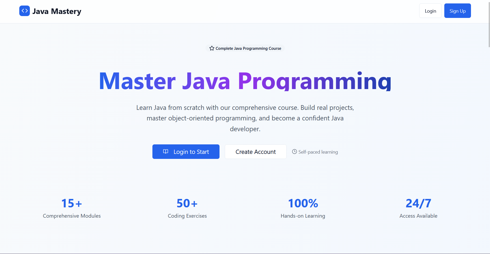
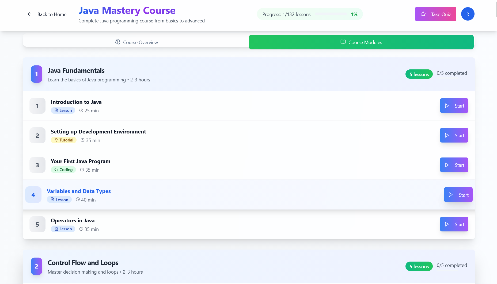
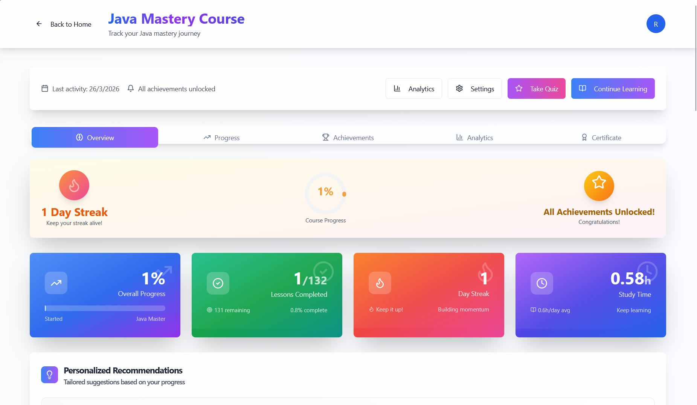
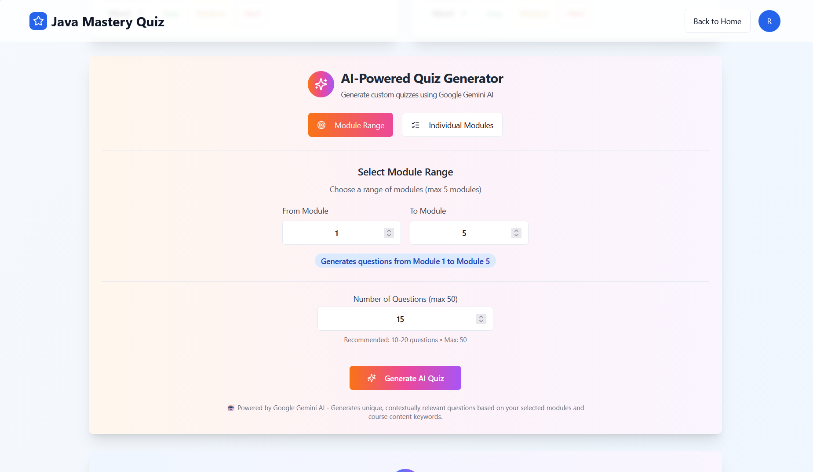
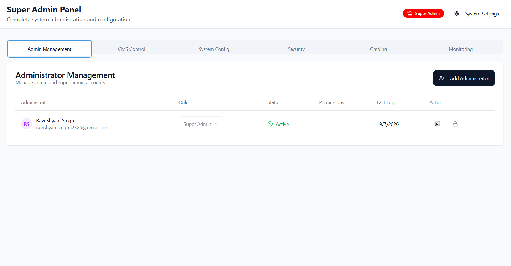

# Java Course Learning Platform

<p align="center">
  <strong>A modern full-stack platform for learning Java, generating AI quizzes, tracking progress, and managing content from one clean dashboard.</strong>
</p>

<p align="center">
  
  
  
  
  
  
  
  
  
  
  
</p>

## Overview

This project is built for students, instructors, and admins who need a simple, structured, and professional learning experience. It combines guided lessons, AI-based quiz generation, a dashboard for progress tracking, and an admin panel for content control.

## Developer

Built and maintained by **Ravi Shyam Singh**.

## Key Features

- Clean landing page with a strong first impression
- Simple home page for course navigation and learning access
- Dashboard for progress tracking and user activity
- AI-powered quiz generation for faster practice
- Admin panel for managing users and content
- Role-based learning workflow for a structured experience

## Tech Stack

- Frontend: React, Vite, TypeScript, Tailwind CSS, shadcn/ui
- Backend: Node.js, Express, MongoDB
- AI & Tools: Gemini API, Monaco Editor, React Query, Axios

## Screenshots

All screenshots are stored in `docs/readme-images/`.

| Page | Preview |
| --- | --- |
| Landing Page |  |
| Home Page |  |
| Dashboard |  |
| AI Powered Quiz Generation |  |
| Admin Panel |  |

## File Structure

- `backend/` - API, authentication, reports, admin services, and database logic
- `workspace/shadcn-ui/` - Frontend application and user interface
- `docs/readme-images/` - Screenshot assets used in this README

## Configuration

Use the environment sample files in the project root to configure the app before running it. The backend expects settings for Gemini, MongoDB, Redis, OAuth, JWT, email, and security.

## Quick Start

```bash
cd backend
npm install

cd ../workspace/shadcn-ui
pnpm install
```

## Run Locally

- Backend: `npm run dev` inside `backend/`
- Frontend: `pnpm dev` inside `workspace/shadcn-ui/`

## Useful Scripts

### Backend

- `npm run dev` - Start the backend in development mode
- `npm run prod` - Start the backend in production mode
- `npm run create-admin` - Create an admin user
- `npm run init-db` - Initialize the database
- `npm run verify-config` - Validate configuration

### Frontend

- `pnpm dev` - Start the frontend in development mode
- `pnpm build` - Build the frontend for production
- `pnpm lint` - Run lint checks

## Notes

- Keep secrets out of version control.
- Place screenshot files in `docs/readme-images/` using the same names referenced above.